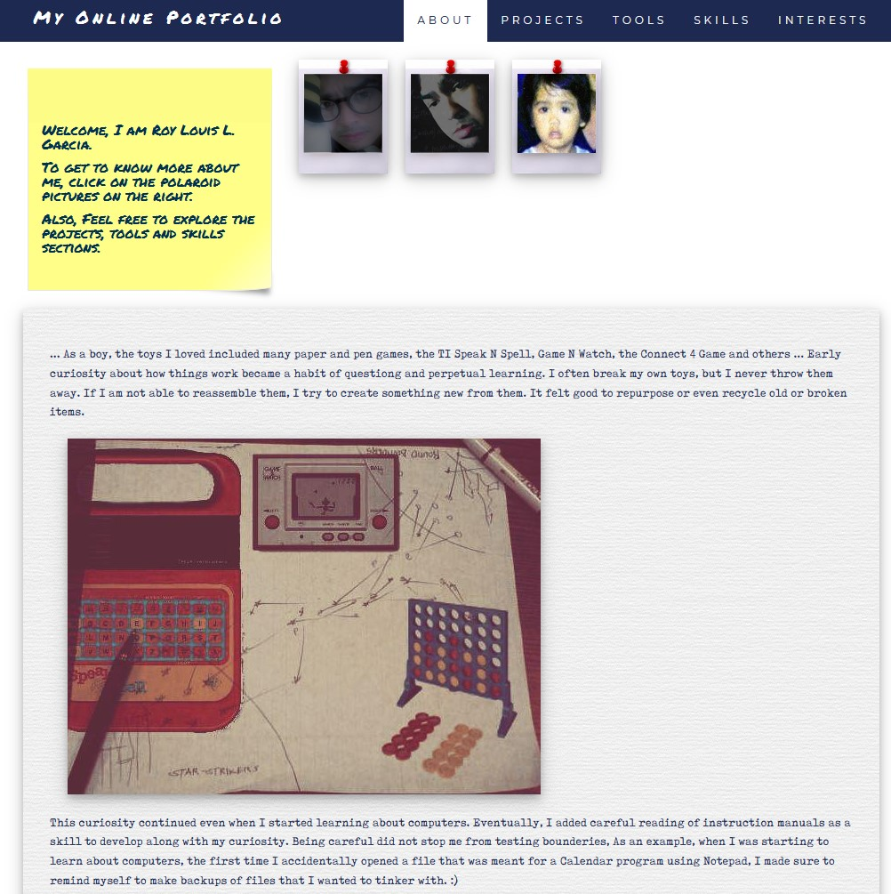
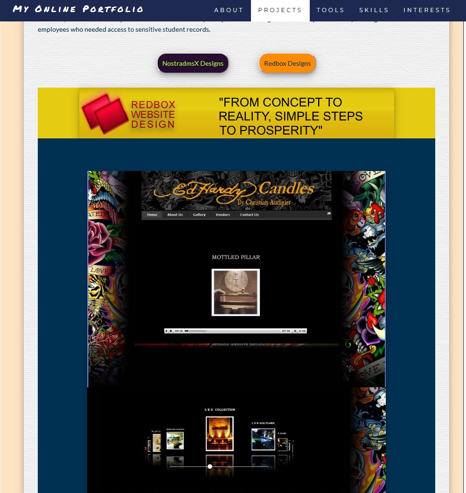
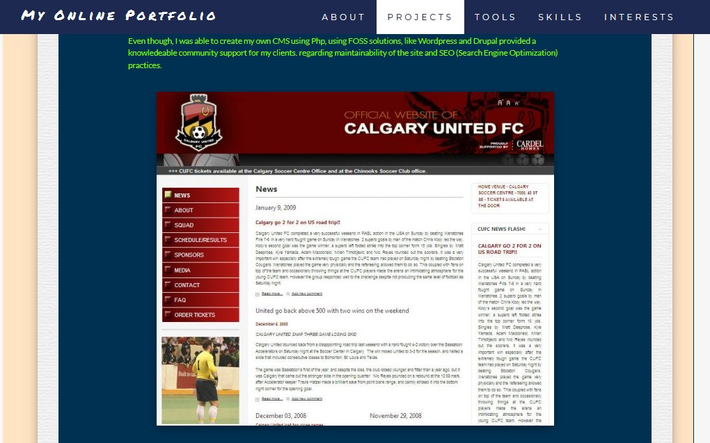

# My Online Portfolio - a Jekyll powered site

## Screenshots:

## Tools I used:

This blog is written in Jekyll and is using the default Minima theme. I have overridden the main.css file to alter the theme.

You can find out more info about customizing your Jekyll theme, as well as basic Jekyll usage documentation at [jekyllrb.com](https://jekyllrb.com/)

You can find the source code for Minima at GitHub:
[jekyll][jekyll-organization] /
[minima](https://github.com/jekyll/minima)

You can find the source code for Jekyll at GitHub:
[jekyll][jekyll-organization] /
[jekyll][ jekyll-organization ]

## Links:

My [NostrA Blog][ nostra-blog ].

My [Online Portfolio][ my-online-portfolio].

My [Linkedin Profile.][ my-linkedin-profile]

My [Twitter Page.][ my-twitter ]

My [Github Page.][ my-github-page ]

[nostra-blog]: https://nostra.dmsx.tech/	"NostrA Blog"

[my-online-portfolio]: https://portfolio.dmsx.tech/	"My Online Portfolio"
[my-linkedin-profile]: https://www.linkedin.com/in/roylouisgarcia/
[my-twitter]: https://twitter.com/roylouisgarcia/
[my-github-page]: https://github.com/roylouisgarcia
[jekyll-organization]: https://github.com/jekyll	"Jekyll Repo"